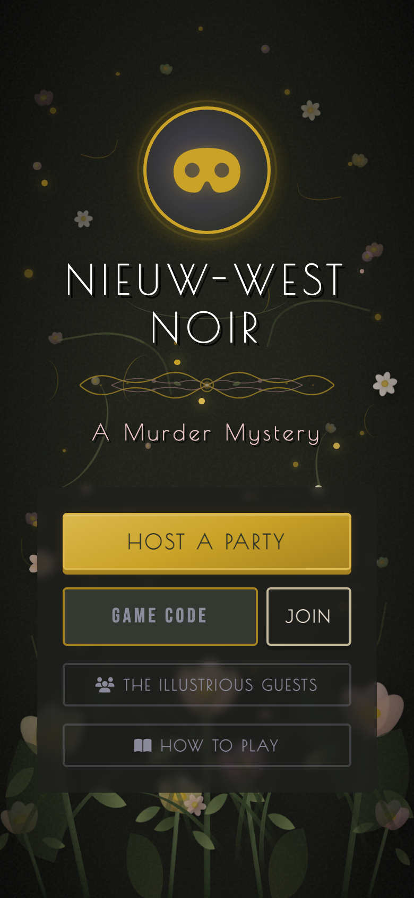
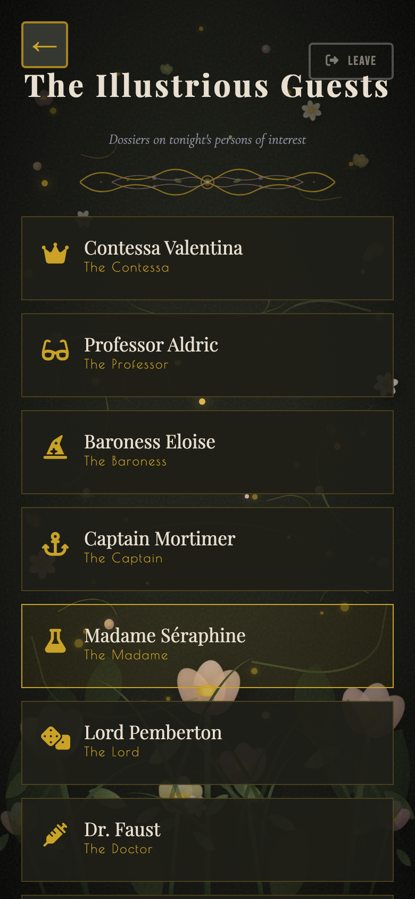
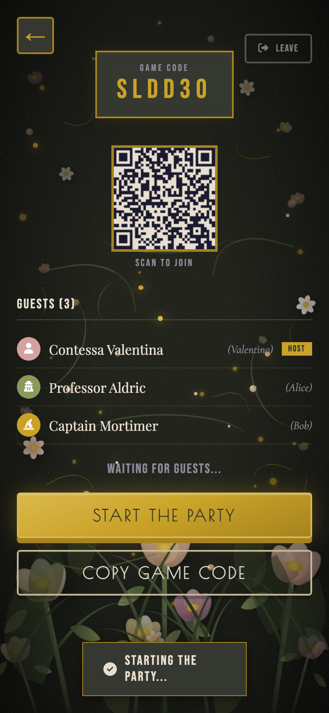
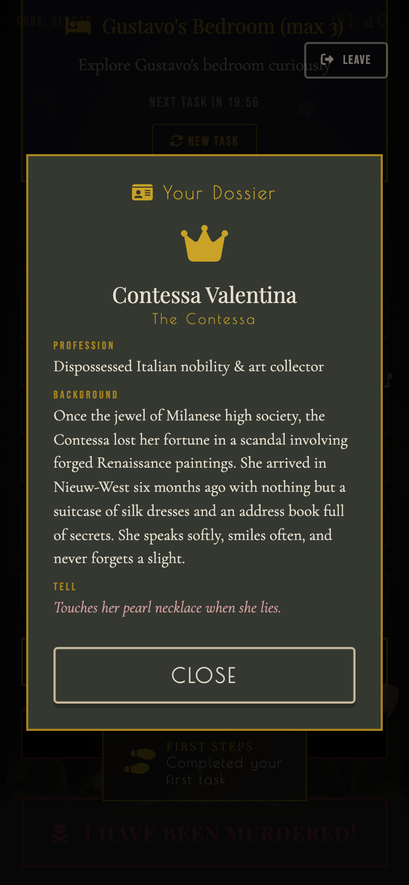
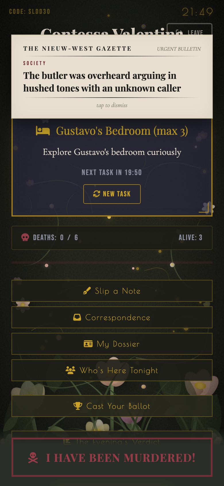
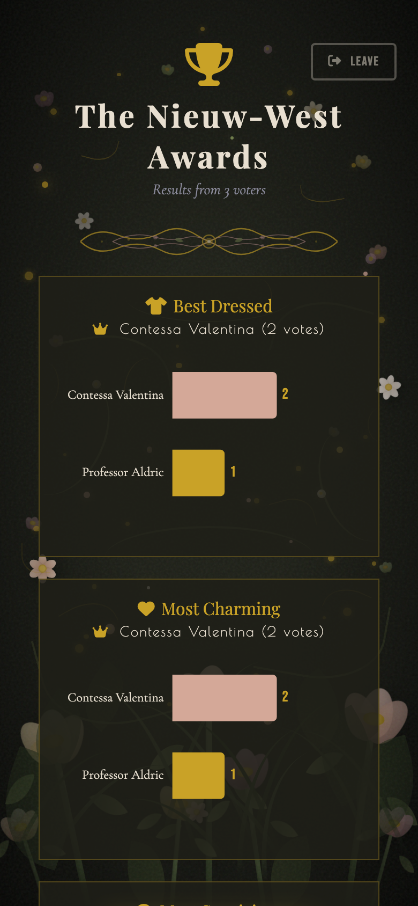
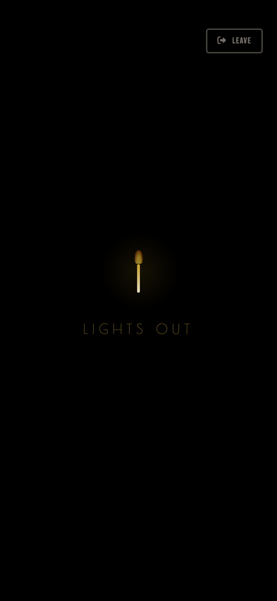
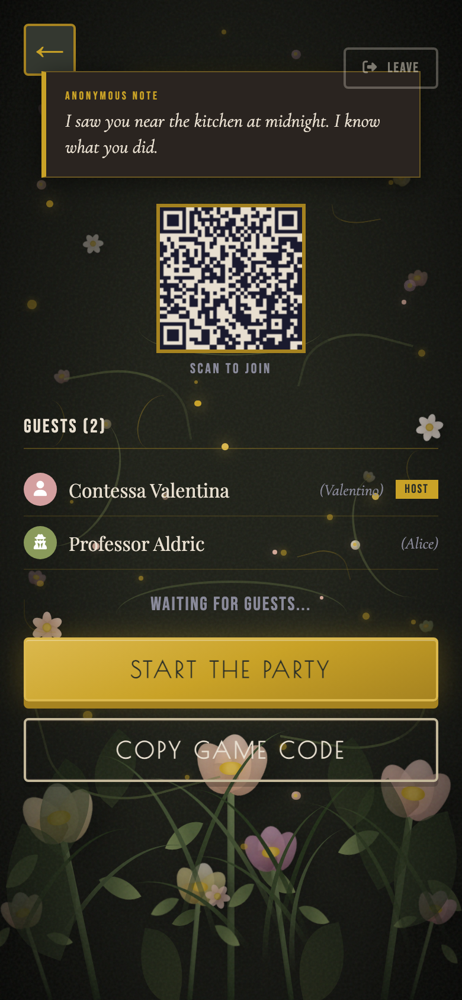
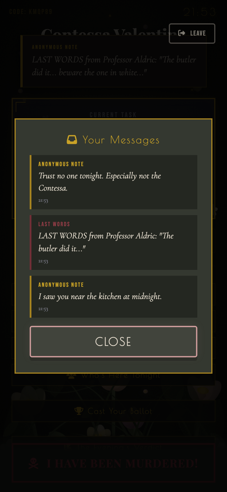

# Nieuw-West Noir — A Murder Mystery Party Game

A noir-themed murder mystery companion app for real-life parties. Players select characters with secret roles (Murderer, Detective, Innocent), receive room-based social tasks, slip anonymous notes, and report murders — all wrapped in an Art Nouveau dark aesthetic.

## Screenshots

<p align="center">
  
  
  
</p>

<p align="center">
  
  
  
</p>

<p align="center">
  
  
  
</p>

## Features

### Core Gameplay
- **Secret Roles** — Murderer, Detective, or Innocent
- **Room Tasks** — New social task every 20 minutes sending you to different rooms
- **Death Reporting** — "I Have Been Murdered!" with optional last words
- **Room Capacity** — Each room shows max occupancy

### Atmosphere
- **Art Nouveau Noir Design** — CSS flowers, vines, gold scrollwork, film grain, vignette
- **The Nieuw-West Gazette** — Periodic noir newspaper headlines drop during gameplay
- **Noir Clock** — Real-time display in gold
- **Typewriter Effect** — Tasks type out letter by letter
- **Death Flash** — Screen flickers red when someone dies
- **Creepy Notifications** — "A scream echoes through the house..."

### Social Features
- **Slip a Note** — Send anonymous messages to other players
- **Correspondence Inbox** — Read all received notes and last words
- **Last Words** — Dying players can leave a dramatic final message
- **Lights Out** — Host triggers blackout on all phones (flickering candle)

### Characters
16 pre-built characters with rich noir backstories, each with:
- Unique profession and title
- Detailed backstory
- A "tell" quirk for roleplay

Browse all characters from "The Illustrious Guests" on the start screen.

### Awards
- **Cast Your Ballot** — Vote during gameplay in 8 noir categories
- **The Evening's Verdict** — ECharts bar charts reveal winners
- Categories: Best Dressed, Most Charming, Most Suspicious, Best Performance, Most Dramatic Death, Sharpest Eye, Life of the Party, Most Devious

### Resilience
- Auto-reconnect on phone wake / tab switch
- LocalStorage persistence — refresh won't lose your state
- Rejoin with same character if disconnected

## Setup

### 1. Google Sheet
Create a new spreadsheet at [sheets.google.com](https://sheets.google.com). Copy the Sheet ID.

### 2. Apps Script
1. Go to [script.google.com](https://script.google.com)
2. Paste `wild-nieuw-west-backend.gs`
3. Replace `YOUR_GOOGLE_SHEET_ID_HERE` with your Sheet ID
4. Deploy > Web app > Execute as Me > Anyone

### 3. Frontend
Replace `API_URL` in `index.html` with your Apps Script URL.

### 4. GitHub Pages
```bash
git init && git add . && git commit -m "init"
gh repo create nieuw-west-noir --public --source=. --push
```
Enable Pages in repo Settings.

## Tech Stack
- **Frontend**: Single HTML file (HTML + CSS + JS)
- **Backend**: Google Apps Script
- **Database**: Google Sheets
- **Charts**: ECharts
- **Hosting**: GitHub Pages
- **Style**: Art Nouveau Noir
